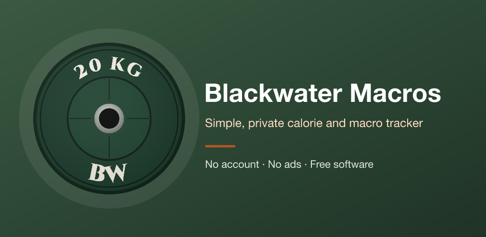
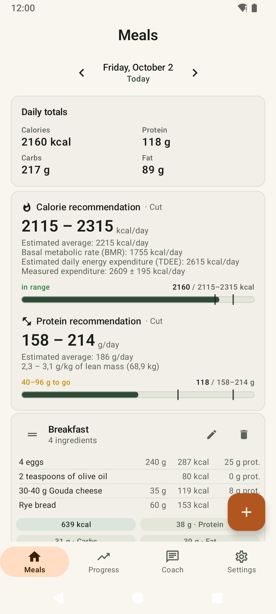
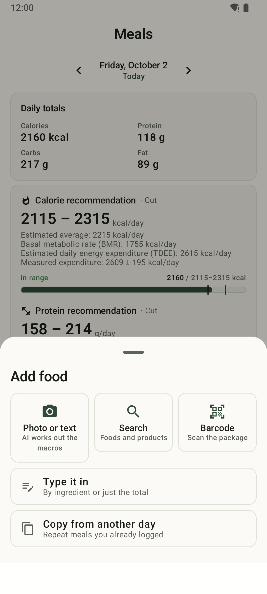
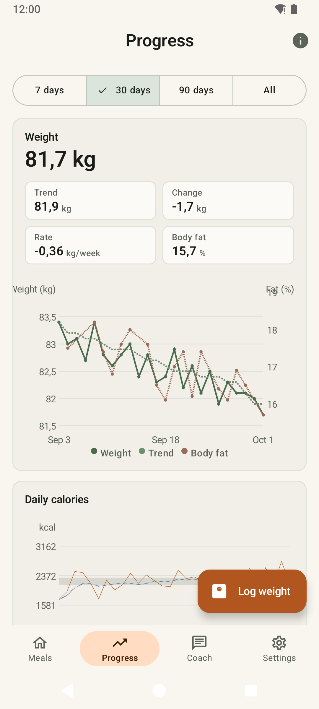
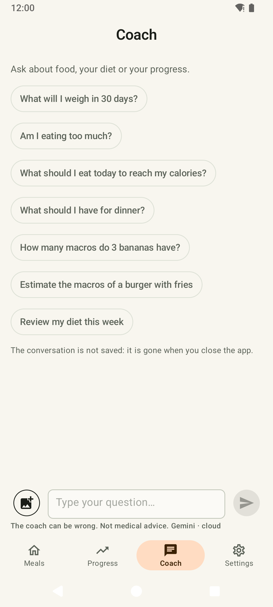
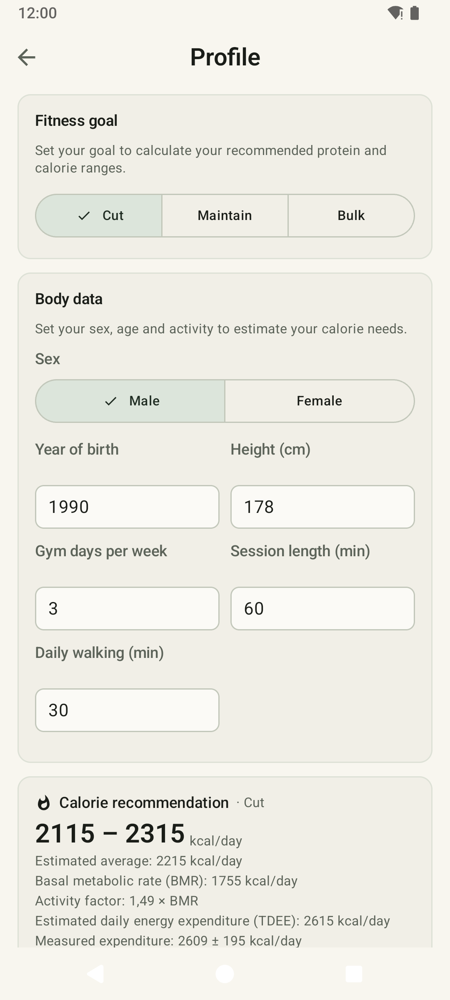

  

<b>A simple, private calorie and macro tracker for Android, with targets based on science.</b> 
Private. No tracking. No ads. Free software.

<i>Coming soon to F-Droid.</i>

  
  
  
  
  

## What it does

Blackwater Macros does one thing and does it well: it tracks **what you eat** (calories,
protein, carbs and fat) and **your weight**, and tells you **how much you should eat** to
reach your goal. That's it. No streaks, badges, social feed, step counter, water tracker or
recipe library.

- **Log a meal in seconds.** Search a built-in database of everyday foods (works offline) or
  millions of products on Open Food Facts, scan a barcode, type it by hand (ingredient by
  ingredient or just the total), or take a photo and let AI estimate it. Copy meals from
  another day or save your usual ones as templates. Deleting asks first, and can be undone.
- **Know your targets.** A calorie range and a protein range for your goal (lose fat,
  maintain, build muscle), with progress bars for the day.
- **See your progress.** A weight trend that smooths out daily water swings, your weekly
  rate, body fat, daily calories against your target and your macro averages.
- **Ask the coach.** A chat that knows your numbers: «What should I have for dinner?»,
  «What will I weigh in 30 days?» (optional AI, see below).
- **Your data is yours.** Everything stays on your phone; export or import it as CSV at any
  time.
- **In your language:** English, Spanish, French, Italian and German.

## How the numbers are calculated

Every formula, its sources and its limits are explained inside the
app (Settings → Methodology) and in [docs/METHODOLOGY.md](docs/METHODOLOGY.md).

- **Basal metabolic rate** with the Mifflin-St Jeor equation, the most accurate of the common
  formulas for healthy adults.
- **Activity level from what you actually do.** Instead of picking «lightly active» or «very
  active» (people usually overrate themselves), you enter your gym days, how long a session
  lasts and how many minutes you walk a day. The app turns that into an activity factor with
  the **factorial method** of the FAO/WHO: the hours of the day spent resting, training and
  walking, each with its own energy cost.
- **A calorie range for your goal**: about −400 kcal a day to lose fat, ±100 to maintain,
  +300 to build muscle. It never goes below your basal needs.
- **Protein from sports-nutrition research**: 1.4–2.0 g/kg to maintain, 1.6–2.2 to build
  muscle, more while cutting; calculated on your lean mass when you log your body fat, and on
  a healthy reference weight when a high BMI is not muscle.
- **Your measured expenditure.** After about four weeks of logging, the app compares what you
  ate with how your weight trend moved and shows how much you really burn, with its margin of
  error, next to the formula's estimate. Formulas are averages; this one is yours.

## AI, only if you want it

- **Photo or text:** take up to five photos of a meal (or of its nutrition label) and/or
  describe it; the AI lists the foods with grams and macros, and you review them before
  saving.
- **Coach:** ask about your diet and progress; it gets a short summary of your data only if
  you allow it, and the conversation is never stored.
- **Bring your own key**: Google Gemini (free key, with a step-by-step guide), OpenAI,
  Anthropic, OpenRouter or any OpenAI-compatible server. **Or run a model on your phone**
  (Gemma 4 or Qwen3, downloaded on request): nothing leaves the device.
- Your key is stored only on your phone (encrypted, excluded from backups) and goes straight
  to the provider you chose, never to us. Photos are shrunk in memory, sent, and discarded.

## Private by design

- **Your data stays on your phone.** The app opens straight on your meals, no sign-up, and
  stores everything on the device.
- **Without logging in, your data never leaves the device.** The app never contacts our
  server: the code refuses any request to it before it leaves the phone. The app only goes online when you ask for something, and only
  to:

  | When | Where |
  |---|---|
  | You search a product online or look up a barcode | Open Food Facts |
  | You open Settings → AI (list of phone models) | GitHub (this repository) |
  | You download a phone AI model | Hugging Face |
  | You use AI with your own key | the provider you chose (Google, OpenAI, Anthropic, OpenRouter, your server) |

  A test (`NetworkHostsTest`) fails if the code ever learns another address.
- **No ads, no analytics, no trackers, no Google services.**
- **Optional sync.** With an account, your data is also kept in the cloud and synced between
  your devices. For now, accounts are by invitation only.

## Permissions

- **Internet**: food search, barcodes, AI and model downloads (see the table above).
- **Camera**: scanning barcodes and photographing meals, only when you use them.
- **Notifications and foreground service**: the progress of a phone AI model download.

## Blackwater Macros and Chompass

If you want an all-in-one AI food diary, have a look at
[Chompass](https://codeberg.org/fitguy/chompass): voice logging, Health Connect, water,
exercise and widgets. Blackwater Macros is the simpler take: meals, macros and weight, with
targets you can trust and see explained. Thanks to Chompass for showing how good a free,
private AI calorie tracker on F-Droid can be; it inspired our photo logging and coach.

## Buy me a yogurt

Blackwater Macros is free, with no ads, and made in my spare time. If it helps you, you can
[buy me a yogurt on Ko-fi](https://ko-fi.com/jordanmontt) (also in the app: Settings → Buy me a
yogurt). Thank you!

## Free software

Blackwater Macros is free software under the **GNU Affero General Public License v3.0 or
later** ([LICENSE](LICENSE)): you can use, study, share and change it. Copyright © 2026
jordanmontt.

Food data: Swiss Food Composition Database (FSVO), Ciqual 2020 (Anses, Licence Ouverte) and
Open Food Facts (ODbL), with Spanish names added by this project.

**Developers:** start with [docs/DEVELOPMENT.md](docs/DEVELOPMENT.md) (setup, build, tests),
then [docs/TECHNICAL.md](docs/TECHNICAL.md) (architecture and rules) and
[docs/RELEASING.md](docs/RELEASING.md) (publishing a version). Bug reports and ideas:
[issues](https://github.com/jordanmontt/Blackwater-Macros/issues).
